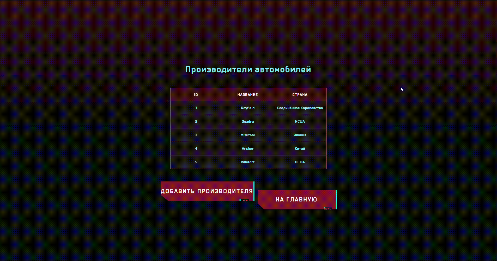

# CarManufacturersMVC (Auto_Fixer_data) — Веб-MVC приложение для управления автомобилями и производителями в стиле киберпанк.
<a id="top"></a>

<div style="position: fixed; inset: 0; z-index: -1; background: linear-gradient(180deg, #321318 0%, #080d11 50%); background-attachment: fixed;"></div>

<nav aria-label="Оглавление" style="position: fixed; top: 120px; right: 20px; width: 260px; max-height: 70vh; overflow: auto; padding: 12px 16px; background: rgba(0,0,0,0.6); border: 2px solid #b9615f; border-radius: 8px; box-shadow: 0 0 20px rgba(185,97,95,0.3);">
  <div style="color:#7ce7ed; font-weight:700; margin-bottom:8px; letter-spacing:1px;">Оглавление</div>
  <ul style="list-style:none; padding-left:0; margin:0; line-height:1.7;">
    <li><a href="#top" style="color:#7ce7ed; text-decoration:none;">Вверх</a></li>
    <li><a href="#assignment" style="color:#7ce7ed; text-decoration:none;">Выданное задание</a></li>
    <li><a href="#folders" style="color:#7ce7ed; text-decoration:none;">Папки</a></li>
    <li><a href="#wwwroot" style="color:#7ce7ed; text-decoration:none;">wwwroot</a></li>
    <li><a href="#tests" style="color:#7ce7ed; text-decoration:none;">Тесты</a></li>
    <li><a href="#manufacturers" style="color:#7ce7ed; text-decoration:none;">Manufacturers</a></li>
    <li><a href="#cars" style="color:#7ce7ed; text-decoration:none;">Cars</a></li>
    <li><a href="#errors" style="color:#7ce7ed; text-decoration:none;">Ошибки</a></li>
    <li><a href="#run" style="color:#7ce7ed; text-decoration:none;">Запуск</a></li>
  </ul>
</nav>

И снова здраствуйте дорогой, любимый, уважаемый и можно продолжать до бесконечности Черемнов Николай!

Я Виктор Оченин, тот кто сделал по вашему приказу данное задание.

В этом README файле я расскажу че да как тут устроено и как я выполнял свою работу. 

Я сделал все в стиле киберпанка 2077. Так как летом после сессии купил себе данную игру и начал в нее играть. (мечта детства).

Ну и собственно, не знаю играли ли вы в нее или нет, но база у меня состоит из производителей и машин оттуда. 

Ну... начнем же. 

<div align="center">
  
</div>

<a id="assignment"></a>
## Выданное задание (Задание 16):


Значит, приложение сделано от предыдущей версии. (Смотреть вот здесь: https://github.com/victor-ochenin/CarManufacturersAPI)

P.s: У меня новая БД. 

Сделано по архитектуре последней версии котора была на паре, ну и собственна которая дана в дз. (прикрепил бы здесь ссылку на ваш исходник, но мне впадлу искать, если че в файле домашки оно есть)

Было доработано и сделано:
1. Сделана выпадающая менюшка с действиями над конкретным производителем/машиной. 
2. Сделаны стили в виде киберпанка, добавлены анимации кнопок, фото машин.

Ну и впринципе все. 

Много тянуть и рассказывать не хочу в этом проекте, чтобы не загружать свое и ваше время. Так что коротко о всем.

<br>
<br>

<a id="folders"></a>
# Папки

## Models
  - `Car.cs`, `Manufacturer.cs`: модели (Машины и производители). - их я тоже покажу чтобы понимали че за поля. 

```csharp
    public class Manufacturer
    {
        public int Id { get; set; }
        
        [Required]
        [StringLength(100)]
        public string Name { get; set; } = string.Empty;
        
        [Required]
        [StringLength(100)]
        public string Country { get; set; } = string.Empty;

        [StringLength(500)]
        public string? PhotoUrl { get; set; }
        
        public ICollection<Car> Cars { get; set; } = new List<Car>();
    }
```

```csharp
public class Car
    {
        public int Id { get; set; }
        
        [Required]
        [StringLength(200)]
        public string Name { get; set; } = string.Empty;
        
        [Required]
        [StringLength(100)]
        public string Class { get; set; } = string.Empty;
        
        [Required]
        [StringLength(100)]
        public string Model { get; set; } = string.Empty;
        
        [Required]
        [StringLength(100)]
        public string Country { get; set; } = string.Empty;
        
        [Required]
        [StringLength(50)]
        public string ProductionYears { get; set; } = string.Empty;
        
        [StringLength(500)]
        public string? PhotoUrl { get; set; }
        
        public int ManufacturerId { get; set; }
        
        public Manufacturer? Manufacturer { get; set; }
    }
```

## Data (Под ней же миграции, но это стандарт их указывать не буду, но упомяну)
  - `ApplicationDbContext.cs`: контекст EF Core с наборами данных. - Стандарт.

  - `DbInitializer.cs`: (опционально) инициализация/заполнение БД. (Вызов закомментирован в `Program.cs`.) - А вот это я вам покажу. 

```csharp
public static void Initialize(ApplicationDbContext context)
        {
            if (context.Manufacturers.Any())
            {
                return;
            }

            var manufacturers = new Manufacturer[]
            {
                new Manufacturer
                {
                    Name = "Rayfield",
                    Country = "Соединённое Королевство",
                    PhotoUrl = "images/photo_manufacturers/rayfield.jpg"
                },
                new Manufacturer
                {
                    Name = "Quadra",
                    Country = "НСША",
                    PhotoUrl = "images/photo_manufacturers/quadra.jpg"
                },
                new Manufacturer
                {
                    Name = "Mizutani",
                    Country = "Япония",
                    PhotoUrl = "images/photo_manufacturers/mizutani.jpg"
                },
                new Manufacturer
                {
                    Name = "Archer",
                    Country = "Китай",
                    PhotoUrl = "images/photo_manufacturers/archer.jpg"
                },
                new Manufacturer
                {
                    Name = "Villefort",
                    Country = "НСША",
                    PhotoUrl = "images/photo_manufacturers/villefort.jpg"
                }
            };

            context.Manufacturers.AddRange(manufacturers);
            context.SaveChanges();

            var cars = new Car[]
            {
                new Car
                {
                    Name = "Rayfield Caliburn",
                    Class = "Гиперкар",
                    Model = "Caliburn",
                    Country = "Соединённое Королевство",
                    ProductionYears = "2070",
                    PhotoUrl = "images/photo_cars/rayfield_caliburn.jpg",
                    ManufacturerId = manufacturers[0].Id
                },
                new Car
                {
                    Name = "Quadra Type-66 \"Cthulhu\"",
                    Class = "Спортивный автомобиль",
                    Model = "Type-66",
                    Country = "НСША",
                    ProductionYears = "2070-е",
                    PhotoUrl = "images/photo_cars/quadra_type66_cthulhu.jpg",
                    ManufacturerId = manufacturers[1].Id
                },
                new Car
                {
                    Name = "Mizutani Shion \"Coyote\"",
                    Class = "Спортивный автомобиль",
                    Model = "Shion",
                    Country = "Япония",
                    ProductionYears = "2060-е",
                    PhotoUrl = "images/photo_cars/mizutani_shion_coyote.jpg",
                    ManufacturerId = manufacturers[2].Id
                },
                new Car
                {
                    Name = "Archer Quartz \"Bandit\"",
                    Class = "Спортивный автомобиль",
                    Model = "Quartz",
                    Country = "Китай",
                    ProductionYears = "2041–2077",
                    PhotoUrl = "images/photo_cars/archer_quartz_bandit.jpg",
                    ManufacturerId = manufacturers[3].Id
                },
                new Car
                {
                    Name = "Villefort Alvarado V4F 570 \"Delegate\"",
                    Class = "Лимузин",
                    Model = "Alvarado",
                    Country = "НСША",
                    ProductionYears = "2044",
                    PhotoUrl = "images/photo_cars/villefort_alvarado_delegate.jpg",
                    ManufacturerId = manufacturers[4].Id
                }
            };

            context.Cars.AddRange(cars);
            context.SaveChanges();
        }
```

Покать решил, чтоб просто понимали что за данные. 

Брал отсюда и структуру и варианты: https://www.xgamers.ru/article/transportnye-sredstva-v-cyberpunk-207-polny-spisok-avtomobiley-i-mototsiklov-luchshiy-transport/

https://cyberpunk.fandom.com/wiki/Cyberpunk_2077_Vehicles

## Api
  - `CarsController.cs`, `ManufacturersController.cs`: API-контроллеры для CRUD-операций.
  - `Messages.cs`: вспомогательные recordы  для API.

Тут ниче не менял с прошлой версии.

## Pages (Razor Pages UI)
  - `Cars/`: страницы `Index`, `Create`, `Edit`, `Delete`, `Details` для автомобилей.
  - `Manufacturers/`: страницы `Index`, `Create`, `Edit`, `Delete`, `Details` для производителей.
  - `Index.cshtml`: начальная страница приложения.

Ну тут даже не знаю стоит ли что-то показывать и хвастаться. cshtml.cs уж точно нет, а вот cshtml...

Я вас пощажу. Сами посмотрите на тестах как это выглядит.

<a id="wwwroot"></a>
## wwwroot (статические файлы)
  - `css/cyberpunk.css`: стили.
  - `js/context-menu.js`: скрипты.
  - `images/`: изображения (логотип и подпапки `photo_cars` с `photo_for_README`).

Вот тут интересно на самом деле. на стили я потратил большую часть времени на этот проект.

В доказательство хочу прикрепить ссылки и фото откуда я брал стиль: 

Ссылка на стиль и анимацию кнопок: https://practicaldev-herokuapp-com.global.ssl.fastly.net/jh3y/css-cyberpunk-2077-buttons-taking-your-css-to-night-city-43l0

Фото стиля от которого отталкивался: 


Если че это просто фото с инета а не из моего акк.

Стили писал с ИИ, конечн, но было сложно. С кнопкой разбирался сам и подгонял divы в ручную через margin. Поэтому на некоторых страничках прям в тегах стиль указан. Для меня так удобней чем писать в начале html файла style.

Скрипты под выпадание менюшки если что. Вынес в отдельный файл так как `Cars/Index.cshtml` и `Manufacturers/Index.cshtml` используют ее.

<br>

<a id="tests"></a>
# Тесты (Демонстрация работы)

## Index.cshtml (основная страница приложения)

<div align="left">
  
</div>

<a id="manufacturers"></a>
## Manufacturers

### 1. Index.cshtml (основная страница)

<div align="left">
  
  </div>

### 2. Details.cshtml (детали)

<div align="left">
  
</div>

### 3. Create.cshtml (создание)

<div align="left">
  
</div>

### 4. Edit.cshtml (редактирование)

<div align="left">
  
</div>

### 5. Delete.cshtml (удаление)

<div align="left">
  
</div>


<a id="cars"></a>
## Cars

### 1. Index.cshtml (основная страница)

<div align="left">
  
</div>

### 2. Details.cshtml (детали)

<div align="left">
  
</div>

### 3. Create.cshtml (создание)

<div align="left">
  
</div>

### 4. Edit.cshtml (редактирование)

<div align="left">
  
</div>

### 5. Delete.cshtml (удаление)

<div align="left">
  
</div>

<a id="errors"></a>
## Ошибочные/исключительные случаи и обработка

### По API:

Все те же случаи проработаны как и в прошлом проекте. 

### По UI: 

- **Неизвестный id**: для `Cars/Details`, `Cars/Edit`, `Cars/Delete` при несуществующем id показывается оформленная панель с сообщением об ошибке. Для производителей аналогично; на `Manufacturers/Delete` есть предупреждение, если есть связанные авто.
- **Валидация форм**: все обязательные поля помечены `required` и с ограничениями `minlength`/`maxlength`. В `Create/Edit` у машин есть выбор производителя из списка.
- **Фото**: в `Details` фото рендерится только если указан `PhotoUrl`. В `Edit` есть живой предпросмотр фото; при битой ссылке показывается текст «Фото не найдено».

### Отличия UI и API при удалении производителей

- **UI (Razor Page `Manufacturers/Delete`)**: при подтверждении удаления сначала удаляет связанные авто, затем производителя (каскад вручную).
- **API `DELETE /api/manufacturer/{id}`**: удаление запрещено, если есть связанные авто — вернётся 400.

<a id="run"></a>
## Как запустить локально

1) Проверьте `DefaultConnection` в `appsettings.json`.
2) Применить миграции: в папке `CarManufacturersMVC` выполнить:
   - `dotnet ef database update`
3) Запуск:
   - `dotnet run` и открыть `http://localhost:5000`.
4) Опционально — заполнение БД демо-данными: раскомментировать блок вызова `DbInitializer.Initialize(...)` в `Program.cs` и перезапустить.
